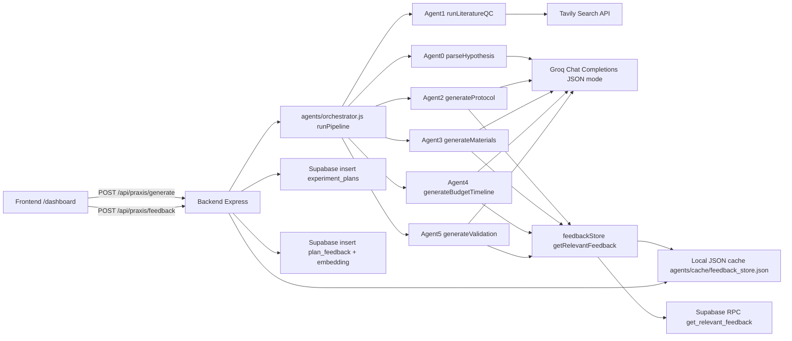

# Praxis — AI Scientist (Hypothesis → Literature QC → Runnable Experiment Plan)

Praxis is a hackathon project aimed at the **“AI Scientist”** challenge: compress the path from a **natural-language scientific hypothesis** to an **operationally realistic experiment plan** a lab could actually execute (protocol, materials with supplier context, budget, timeline, validation).

This repository is a **monorepo** with four cooperating layers:

| Layer | Folder | Responsibility |
|------|--------|------------------|
| **Frontend** | `frontend/` | Polished UI: hypothesis input, novelty display, plan navigation, scientist review |
| **Backend** | `backend/` | HTTP API + orchestration glue: runs the agent pipeline, persists to Supabase, embeds feedback |
| **Agents** | `agents/` | The “brains”: staged LLM pipeline + literature search + retrieval-augmented corrections |
| **Database** | `database/` | Supabase/Postgres schema (pgvector), RLS policies, SQL RPCs for RAG, seeds, automation scripts |

---

## What the product does (mapped to the challenge brief)

### 1) Input — natural language hypothesis
The user enters a hypothesis in plain language and selects a **domain** (Diagnostics / Gut Health / Cell Biology / Climate).

### 2) Literature QC — fast novelty signal + references
Before deep plan synthesis, the pipeline performs a **lightweight literature check** using **Tavily search** + **LLM classification** into a novelty signal:

- `not_found`
- `similar_work_exists` (**must match this exact string**; not `similar_exists`)
- `exact_match_found`

It returns **0–3 references** (title/url/relevance) suitable for UI display.

### 3) Experiment plan — operational deliverable
The system generates structured sections aligned to the judging rubric:

- **Protocol** (stepwise bench reality: controls, QC checkpoints, durations)
- **Materials** (anchored to a curated catalog when possible + realistic vendor patterns when not)
- **Budget** (labor/equipment/contingency rules; materials subtotal treated as authoritative input)
- **Timeline** (phased schedule with procurement constraints)
- **Validation** (success criteria tied to hypothesis thresholds, stats, controls, failure modes)

### Stretch goal — scientist review loop (RAG)
Scientists can rate/correct sections. Corrections are:

- stored in **Supabase** (`plan_feedback`) with **`vector(384)`** embeddings (same embedding space as agents)
- also appended to a **local JSON cache** (`agents/cache/feedback_store.json`) for fast iteration during demos

During later generations, agents retrieve “similar past corrections” and inject them as **few-shot** context (protocol/materials/budget/validation sections).

---

## End-to-end architecture (how requests flow)



**Important integration detail:** the UI does **not** call Supabase Edge Functions for generation anymore. Generation is **`fetch()` → backend** (`/api/praxis/generate`). Supabase is still used for **data persistence + vector retrieval**.

---

## Tech stack (what we use, where)

### Frontend (`frontend/`)
- **React 19** + **Vite** dev server (`npm run dev`)
- **TanStack Router** (`src/routes/*`, generated `src/routeTree.gen.ts`)
- **UI**: Radix primitives + Tailwind CSS v4 + shadcn-style components under `src/components/ui/*`
- **Icons**: `lucide-react`
- **Toasts**: `sonner`
- **Supabase JS client** exists for auth/client patterns (`src/integrations/supabase/*`), but **plan generation** is wired to the backend API (see `src/routes/dashboard.tsx`).

### Backend (`backend/`)
- **Node.js (ESM)** + **Express**
- **CORS** enabled for local UI dev
- **dotenv** loads:
  - `backend/.env` (always, resolved relative to `backend/server.js`)
  - `agents/.env` (loaded from `../agents/.env` for local convenience)
- **Supabase admin** (`@supabase/supabase-js` + **service role key**) for server-side inserts and RPC calls
- **Embeddings** (`@xenova/transformers`, **`Xenova/all-MiniLM-L6-v2`**, **384 dims**) used when saving scientist feedback server-side

### Agents (`agents/`)
- **Orchestrator**: `agents/orchestrator.js` exports `runPipeline(hypothesis, options)` and sequences **six stages** (**Agent 0 → Agent 5**)
- **LLM calls**: `agents/lib/groqClient.js`
  - Primary: **Groq** (`groq-sdk`) with JSON mode when `expectJSON: true`
  - Default model: `process.env.GROQ_MODEL` else **`llama-3.3-70b-versatile`**
  - Fallback: **Google Gemini** (`@google/generative-ai`) when Groq is rate-limited (429/503)
- **Literature search**: `agents/lib/tavilyClient.js` uses **`tavily`** SDK (`TAVILY_API_KEY`)
- **Caching**: `agents/lib/cacheManager.js` (file-based Tavily/QC cache; controlled by `ENABLE_TAVILY_CACHE`)
- **Structured parsing/validation**: `zod` + `agents/lib/jsonSafeParse.js`
- **Embeddings / similarity**: `agents/lib/embedder.js` uses **`Xenova/all-MiniLM-L6-v2` (384-dim)**
- **Feedback store (local)**: `agents/lib/feedbackStore.js` reads/writes `agents/cache/feedback_store.json`
- **Feedback store (Supabase hybrid)**: `agents/lib/supabaseFeedback.js` calls **`get_relevant_feedback`** RPC when `SUPABASE_URL` + `SUPABASE_SERVICE_ROLE_KEY` are present in the agents process environment

### Database (`database/`)
- **Supabase = Postgres 15 + pgvector**
- **Vectors are `vector(384)` everywhere** (matches Xenova embeddings; **not** OpenAI 1536)
- SQL migrations + seeds + docs under `database/`
- Operational notes live in `database/README.md` (especially around optional `exec_sql` helper for automation)

---

## Agent pipeline (detailed)

All agents are plain **ESM JavaScript** modules under `agents/agents/`. Shared utilities live in `agents/lib/`.

### Agent 0 — Hypothesis parser
- **File**: `agents/agents/agent0_parser.js`
- **Purpose**: Convert a messy hypothesis string into structured JSON (domain, intervention, outcome, assay, controls, etc.)
- **LLM**: `callLLM(...)` with strict JSON-only instructions
- **Validation**: `zod` schema (`ParsedHypothesisSchema`)
- **Output**: `domain` must be one of:
  - `diagnostics`, `gut_health`, `cell_biology`, `climate`, `other`

### Agent 1 — Literature QC (novelty + references)
- **File**: `agents/agents/agent1_qc.js`
- **Purpose**: “Plagiarism check for science” — quick signal, not a full review article
- **Steps**:
  1. `agents/lib/cacheManager.js` may return cached QC
  2. `agents/lib/tavilyClient.js` runs a Tavily search (`runQCSearch`)
  3. `callLLM` classifies results into JSON validated by `QCResultSchema`
- **Novelty enum strings** (must match DB constraints + downstream logic):
  - `not_found`
  - `similar_work_exists`
  - `exact_match_found`
- **References**: up to 3 `{ title, url, relevance }`

### Agent 2 — Protocol generation (Chain 1)
- **File**: `agents/agents/agent2_protocol.js`
- **Purpose**: Step-by-step executable protocol with lab-realistic constraints (controls, QC steps, durations)
- **RAG**: pulls few-shot corrections via `getRelevantFeedback(..., section='protocol')`

### Agent 3 — Materials / supply chain (Chain 2)
- **File**: `agents/agents/agent3_materials.js`
- **Purpose**: Materials list grounded in procurement reality
- **Catalog grounding**: reads `agents/data/reagent_catalog.json` and injects a compact “approved vendor list” into the prompt
- **RAG**: `getRelevantFeedback(..., section='materials')`

### Agent 4 — Budget + timeline (Chain 3)
- **File**: `agents/agents/agent4_budget_timeline.js`
- **Purpose**: Cost model + phased schedule; keeps materials subtotal authoritative
- **RAG**: `getRelevantFeedback(..., section='budget')`

### Agent 5 — Validation / QA stats framing (Chain 4)
- **File**: `agents/agents/agent5_validation.js`
- **Purpose**: Success criteria tied to hypothesis thresholds, stats approach, controls, failure modes
- **RAG**: `getRelevantFeedback(..., section='validation')`

### Orchestrator — the single “full pipeline” entrypoint
- **File**: `agents/orchestrator.js`
- **Export**: `runPipeline(hypothesis, { skipQC, skipFeedback })`
- **Assembles** `finalPlan` containing parsed hypothesis, novelty/QC, protocol, materials, budget/timeline, validation, metadata

---

## Backend API (Express)

Base URL is `http://localhost:<PORT>` where `<PORT>` comes from `backend/.env` (`PORT`, default **3001** if unset).

### Integrated Praxis endpoints (used by the UI)
- **`POST /api/praxis/generate`**
  - Body: `{ "hypothesis": string, "domain": "Gut Health" | ... }` (domain is the UI label)
  - Runs `agents/orchestrator.js` via dynamic import (`backend/src/services/agentsRunner.js`)
  - If Supabase admin env is configured, inserts into **`experiment_plans`**
  - Returns the **UI-shaped** `PraxisPlan` JSON (mapped in `backend/src/services/praxisMapper.js`)

- **`POST /api/praxis/feedback`**
  - Body includes: `plan_id`, `section`, `rating`, `original_content`, `correction`, optional `correction_reason`, `experiment_type`, `domain` (**slug** like `gut_health`)
  - Embeds correction text (384 dims) and inserts **`plan_feedback`**
  - Also attempts to append to local `agents/lib/feedbackStore.js` path for immediate retrieval

### Legacy/demo endpoints (still present)
These were used for early backend bring-up tests and simple demos:
- `GET /api/health`
- `GET /api/plans`
- `POST /api/feedback` (in-memory demo store)
- `POST /api/generate` (minimal Groq echo; not the full Praxis UI pipeline)

> For the hackathon demo path, treat **`/api/praxis/*`** as the “real” integration surface.

---

## Frontend UX (what exists in the UI)

### Routes
- **`/`**: marketing/landing page (`frontend/src/routes/index.tsx`)
- **`/dashboard`**: mission control (`frontend/src/routes/dashboard.tsx`)
  - hypothesis textarea + domain select
  - generates plan via **`POST ${VITE_PRAXIS_API_URL}/api/praxis/generate`**
  - novelty badge + tabs: protocol/materials/budget/timeline/validation
  - **Scientist Review Mode** submits structured corrections to **`POST /api/praxis/feedback`**

### Key UI modules
- `frontend/src/components/praxis/GenerationStepper.tsx` (progress UI; not a strict mirror of backend stages)
- `frontend/src/components/praxis/NoveltyBadge.tsx`
- `frontend/src/components/praxis/PlanViews.tsx` + `MaterialsTable.tsx`
- `frontend/src/components/praxis/ReviewControls.tsx`

### Frontend environment variables (`frontend/.env`)
Minimum for local integrated runs:
- **`VITE_PRAXIS_API_URL`**: must match your backend origin (scheme + host + port)
- Supabase client vars still exist for other integrations:
  - `VITE_SUPABASE_URL`
  - `VITE_SUPABASE_PUBLISHABLE_KEY` (anon/publishable)

---

## Database layer (Supabase)

All SQL + scripts live in `database/`. Start with `database/README.md` for the operational playbook.

### Tables (high level)
- **`experiment_plans`**: one row per generated plan; includes JSON sections + `embedding vector(384)`
- **`plan_feedback`**: structured scientist corrections + `embedding vector(384)` + `applied_count`
- **`tavily_cache`**: persistent Tavily/QC cache keyed by hypothesis hash (7-day TTL semantics)

### RAG SQL function
- **`get_relevant_feedback(query_embedding, filter_domain, filter_section, max_results)`**
  - Filters: embeddings present, section match, domain match (or `filter_domain='other'` behavior per SQL), `rating <= 3`, non-trivial correction length
  - Orders by pgvector cosine distance operator **`<=>`**

### Important Postgres lesson (already fixed in-repo)
Partial indexes cannot use volatile functions like `now()` in predicates. `database/migrations/006_indexes.sql` uses a plain index on `expires_at` instead.

### Database automation caveat (`npm run seed`)
The seed runner historically expected a Postgres RPC named **`exec_sql`** (not created by default). If you don’t install that RPC, use the **Supabase SQL editor** to run `database/seeds/*.sql` directly (this is documented in `database/README.md`).

---

## Environment variables (complete checklist)

### `agents/.env` (required for real runs)
Used directly by agent modules when the orchestrator runs.

- **`GROQ_API_KEY`**: required for primary LLM path
- **`GROQ_MODEL`**: optional override (defaults in `agents/lib/groqClient.js`)
- **`TAVILY_API_KEY`**: required for literature QC search path
- **`GEMINI_API_KEY`**: optional fallback when Groq is rate limited
- **`TAVILY_MAX_CREDITS_PER_RUN`**: defaults to `4` in `agents/lib/tavilyClient.js`
- **`ENABLE_TAVILY_CACHE`**: enables file cache in `agents/lib/cacheManager.js`
- **`DEBUG_PROMPTS`**: logs prompts when `true`
- **`SUPABASE_URL`**, **`SUPABASE_SERVICE_ROLE_KEY`**: enables hybrid DB RAG retrieval from agents (`agents/lib/supabaseFeedback.js`)

### `backend/.env` (integration + persistence)
Loaded by `backend/server.js` (and it also loads `../agents/.env`).

Typical keys:
- **`PORT`**, **`BACKEND_URL`** (recommended for consistent client config)
- **`SUPABASE_URL`**, **`SUPABASE_SERVICE_ROLE_KEY`**: enables:
  - inserting `experiment_plans` after generation
  - inserting embedded `plan_feedback`
- **`GROQ_API_KEY` / `TAVILY_API_KEY`**: optional duplicates if you want backend-only configuration (agents env still recommended)

### `frontend/.env`
- **`VITE_PRAXIS_API_URL`**: backend origin for `/api/praxis/*` calls
- **`VITE_SUPABASE_URL`**, **`VITE_SUPABASE_PUBLISHABLE_KEY`**: Supabase client (non-admin)

### `database/.env`
Used by `database/scripts/*` for migrations/seeds/embed/verify automation.

---

## How to run the full stack (local)

You need **three terminals** (backend + frontend; agents run inside backend):

### Terminal A — backend
```powershell
cd e:\Hack-nation_hackathon\Praxis\backend
npm install
npm start
```

### Terminal B — frontend
```powershell
cd e:\Hack-nation_hackathon\Praxis\frontend
npm install
npm run dev
```

### Terminal C — (optional) database maintenance
Only needed when applying schema changes, embeddings backfill, verification:
```powershell
cd e:\Hack-nation_hackathon\Praxis\database
npm install
# follow database/README.md for SQL editor steps + optional npm scripts
```

### First-run expectations / perf notes
- The first call that loads **Xenova** embeddings may take noticeable time (model download/cache).
- Full pipeline latency is dominated by **multiple LLM calls** + **Tavily** + embedding loads.

---

## Testing commands

### Backend smoke tests (from `backend/`)
These scripts assume the backend is reachable at `BACKEND_URL` or default `PORT` (see `backend/tests/_util.js`).

```powershell
cd e:\Hack-nation_hackathon\Praxis\backend
npm run test:health
npm run test:plans
npm run test:feedback
```

`npm run test:generate` is a Groq-specific test and requires a valid `GROQ_API_KEY`.

### Agents unit tests (from `agents/`)
```powershell
cd e:\Hack-nation_hackathon\Praxis\agents
npm install
npm run test:parser
npm run test:qc
npm run test:protocol
npm run test:materials
npm run test:budget
npm run test:validation
npm run test:full
```

---

## Security & secrets (read this once — it prevents demo disasters)

- **Never commit** `.env` files with real keys (they should remain local).
- **Never expose `SUPABASE_SERVICE_ROLE_KEY` in the browser**. It is **server-only** (`backend/.env`).
- The frontend should only use the **anon/publishable** Supabase key for client-side features.
- Treat **`/api/praxis/feedback`** as trusted demo surface: in production you’d add auth, abuse controls, and stricter validation.

---

## Repo map (quick navigation)

```
Praxis/
  agents/                 # LLM + Tavily pipeline, embeddings, local feedback cache
  backend/                # Express API + Supabase persistence + embedding on feedback
  database/               # SQL migrations/seeds/docs + Node automation scripts
  frontend/               # Vite + React UI (Mission Control)
```

---

## “Challenge-quality” demo hypotheses (sample inputs)

Use these verbatim in `/dashboard` with the matching domain:

- **Diagnostics**: paper-based electrochemical biosensor / CRP / whole blood / ELISA-class sensitivity / ≤10 minutes
- **Gut Health**: LGG + C57BL/6 + FITC-dextran permeability + tight junction proteins
- **Cell Biology**: trehalose vs DMSO cryoprotectant + HeLa post-thaw viability threshold
- **Climate**: *Sporomusa ovata* bioelectrochemical CO₂ → acetate rate benchmark threshold

---

## Current limitations (honest / judge-relevant)

- The UI stepper is **aspirational animation**; true stage timing is dominated by LLM/Tavily/embedding loads.
- `database/scripts/run_migrations.js` / `run_seeds.js` may require a custom **`exec_sql`** RPC or manual SQL editor application (see `database/README.md`).
- Catalog coverage is **partial by design** (`agents/data/reagent_catalog.json`); agents may still propose plausible SKUs outside the catalog but must mark them as unverified.

---

## Where to edit what (for teams extending Praxis)

- **Change prompting / JSON schemas**: `agents/agents/agent*.js`
- **Change model routing / JSON mode**: `agents/lib/groqClient.js`
- **Change literature retrieval behavior**: `agents/lib/tavilyClient.js`
- **Change RAG retrieval logic**:
  - SQL side: `database/migrations/005_functions.sql`
  - Agent side merge: `agents/lib/feedbackStore.js` + `agents/lib/supabaseFeedback.js`
- **Change UI layout / plan rendering**: `frontend/src/routes/dashboard.tsx` + `frontend/src/components/praxis/*`
- **Change persistence mapping**: `backend/src/routes/praxis.js` + `backend/src/services/praxisMapper.js`

---

## License / attribution

Built for a hackathon challenge context (“AI Scientist”). Vendor names, catalog formats, and protocol patterns are used as **realistic research operations** examples and must be verified before real procurement.
