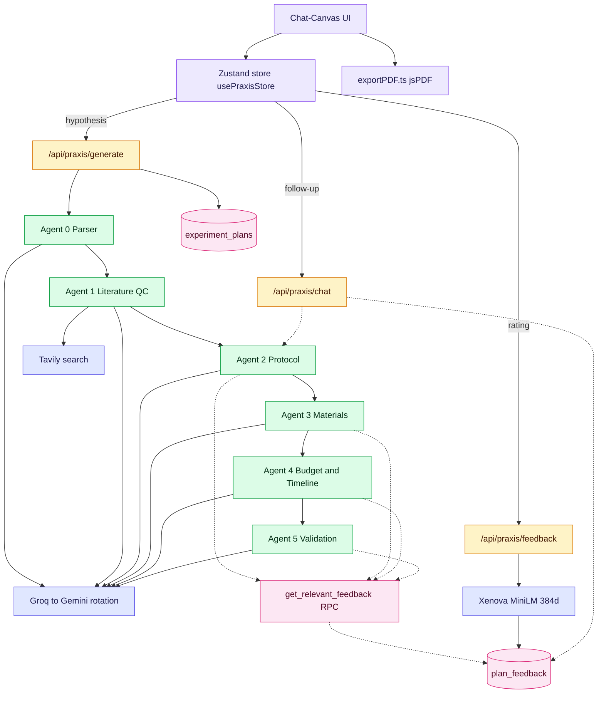

# Praxis

> **From a hypothesis to a runnable experiment plan, in minutes — not weeks.**

Praxis is an AI scientist-in-the-loop. You type a hypothesis in plain English; Praxis runs a literature novelty check, then drafts a full benchwork-realistic plan — protocol, materials with catalog numbers, budget, timeline, and validation strategy — on a live canvas you can refine through chat.

Built for the **AI Scientist** challenge (Fulcrum Science × MIT Club).

---

## Table of contents

1. [The leap we're making](#the-leap-were-making)
2. [What it looks like in 60 seconds](#what-it-looks-like-in-60-seconds)
3. [Architecture](#architecture)
4. [The five-agent pipeline](#the-five-agent-pipeline)
5. [The feedback loop (where Praxis gets smarter)](#the-feedback-loop)
6. [Reliability — multi-model rotation](#reliability)
7. [Tech stack](#tech-stack)
8. [API reference](#api-reference)
9. [Environment variables](#environment-variables)
10. [Quick start (3 commands)](#quick-start)
11. [Repo layout](#repo-layout)
12. [Demo script for judges](#demo-script-for-judges)
13. [Honest limitations](#honest-limitations)

---

## The leap we're making

A scientist with a question used to face a week of work before they could even *attempt* the experiment:

> read 30 papers → draft a protocol → price reagents → fight a lab manager about budget → realize controls are missing → start over.

Praxis collapses that into a chat. The deliverable isn't a paragraph; it's an **operationally realistic experiment plan** — the same artifact a postdoc would hand a PI for go/no-go review.

### What separates Praxis from "ChatGPT, but for science"

| Concern | Generic LLM | Praxis |
|---|---|---|
| Literature grounding | Hallucinates citations | **Tavily** search → real URLs, novelty signal classified into 3 buckets |
| Protocol realism | Plausible but vague | Stepwise with **controls, QC checkpoints, durations** baked in by Agent 2 |
| Materials | Generic reagents | **Catalog-grounded** against `agents/data/reagent_catalog.json` (real SKUs, real suppliers) |
| Budget | Hand-wavy total | **Materials subtotal is authoritative** input; labor + contingency layered on top |
| Improving over time | Forgets every chat | **pgvector RAG** retrieves past scientist corrections as few-shot context |
| Reliability under load | Fails on first 429 | **Multi-model rotation**: Groq[0..N] → Gemini[0..N] before giving up |

---

## What it looks like in 60 seconds

The frontend is a **single-page chat-canvas split**. There is no `/dashboard` — the same route flips between two layouts driven by Zustand state.

### 1. Landing — uncluttered, focused on input

- Top nav: the **Praxis** wordmark (custom monogram + Instrument Serif italic) with a theme toggle
- Hero: "From hypothesis to runnable experiment."
- Domain pills (Diagnostics / Gut Health / Cell Biology / Climate / Other) — clicking one **only** sets the domain; it does not auto-fill the textarea
- Optional "Need inspiration?" disclosure reveals sample hypotheses as click-to-fill examples
- Single textarea + submit

### 2. Live pipeline — Stage 1 (Literature QC)

The moment you submit:

- The view splits — chat panel on the left, canvas on the right
- A **live status block** in the chat shows three QC stages: parsing → searching → classifying
- A **NoveltyCard** appears with the result (`Not Found` / `Similar Exists` / `Exact Match`) plus 0–3 clickable references
- A **"Generate Experiment Plan"** CTA awaits your decision

### 3. Live pipeline — Stage 2 (Plan synthesis)

Click Generate, and:

- Canvas tabs (Protocol → Materials → Budget → Timeline → Validation) **populate one by one** with skeleton-to-filled animations
- Each tab is auto-focused as it lands (you can override with manual tab clicks)
- The chat shows a "Plan complete" assistant message with a download/refine prompt

### 4. Refine — chat-driven inline regeneration

Type *"the budget is too high, cut equipment by half"* in the chat:

- Backend `/api/praxis/chat` endpoint classifies which section to update (heuristics first, LLM if needed)
- Re-runs **only the relevant agent**, not the whole pipeline
- The patched section is hot-swapped in the canvas with a **diff indicator** highlighting what changed
- Your correction is also persisted to the **feedback store** so future generations learn from it

### 5. Per-section feedback + PDF export

- Thumbs-up / thumbs-down on any tab → `POST /api/praxis/feedback` with rating + correction
- One-click **"Export PDF"** in the canvas toolbar generates a clean, multi-page report with clickable reference links and Unicode-sanitized text (no rendering glitches in `jsPDF`'s WinAnsi font)

---

## Architecture



**Key integration choice:** the UI talks to the **backend Express API**, not Supabase Edge Functions. Supabase is the **persistence + vector retrieval** layer, not the orchestrator.

---

## The five-agent pipeline

All agents live in `agents/agents/`, share `agents/lib/`, and are plain ESM modules. The orchestrator (`agents/orchestrator.js`) sequences them and exports `runPipeline(hypothesis, options)`.

| # | Agent | File | What it does | RAG section |
|---|---|---|---|---|
| 0 | Hypothesis Parser | `agent0_parser.js` | Extracts domain, intervention, outcome, assay, controls into a Zod-validated JSON | — |
| 1 | Literature QC | `agent1_qc.js` | Tavily search + LLM classification → `not_found` / `similar_work_exists` / `exact_match_found` + ≤3 references | — |
| 2 | Protocol | `agent2_protocol.js` | Stepwise protocol with controls, QC checkpoints, durations | `protocol` |
| 3 | Materials | `agent3_materials.js` | Materials list grounded in `agents/data/reagent_catalog.json`; flags out-of-catalog SKUs as unverified | `materials` |
| 4 | Budget + Timeline | `agent4_budget_timeline.js` | Cost model (labor + materials + contingency); phased schedule with procurement constraints | `budget` |
| 5 | Validation | `agent5_validation.js` | Success criteria, statistical test, controls, failure modes | `validation` |

**Graceful degradation.** If any agent fails (LLM error, JSON parse error, etc.), the orchestrator returns `{ ok: false, data: null }` for that stage and assembles the partial plan with `null`/empty fallbacks. Nothing is hardcoded; the canvas honestly shows what was built and what was not.

---

## The feedback loop

This is what makes Praxis improve over time instead of being a one-shot demo.

### Two paths into the store

1. **Explicit rating + correction** — user clicks thumbs-down on a section, types a correction → `POST /api/praxis/feedback` → embedded with `Xenova/all-MiniLM-L6-v2` (384-dim) → inserted into `plan_feedback` *and* appended to `agents/cache/feedback_store.json` for instant in-process recall.
2. **Inline chat refinement** — user types *"add a positive control with C57BL/6 mice"* → `POST /api/praxis/chat` → if the message is substantive (>40 chars) and not a generic regen request, it's also stored as `rating: 2` feedback. Generic regen requests are **filtered out** so they don't pollute the RAG store.

### Two paths out of the store

When Agents 2–5 build a section, they call `getRelevantFeedback(parsedHypothesis, section)` which:

1. Embeds the current hypothesis context (384-d)
2. Hits the Supabase RPC `get_relevant_feedback(query_embedding, filter_domain, filter_section, max_results)` — filters: `rating <= 3`, `length(correction) > 10`, ordered by pgvector cosine distance (`<=>`)
3. Falls back to the local JSON cache if Supabase is unavailable
4. Injects the top matches as **few-shot examples** in the agent's system prompt

### Why filter to `rating <= 3`?

Because few-shot RAG learns from **errors**, not validations. A thumbs-up tells you "this output was good" — it shouldn't be re-injected as a "fix this" example. Positive feedback is recorded for analytics, but not retrieved during generation.

---

## Reliability

LLM APIs go down. Free tiers hit token-per-day caps. We solved this without paying for upgrades.

### Groq → Gemini, multi-model on each side

```
Groq[ llama-3.3-70b-versatile ]
   ↓ 429 / TPD exhausted
Groq[ llama-3.1-8b-instant ]
   ↓ 429 / TPD exhausted
Groq[ gemma2-9b-it ]
   ↓ 429 / TPD exhausted
Groq[ mixtral-8x7b-32768 ]
   ↓ all Groq exhausted
Gemini[ gemini-2.0-flash ]
   ↓ rate-limited / 404
Gemini[ gemini-2.0-flash-lite ]
   ↓ ...
Gemini[ gemini-2.0-flash-exp ]
   ↓ ...
Gemini[ gemini-1.5-flash-latest ]
```

This lives in `agents/lib/groqClient.js`. Because Groq enforces token quotas **per model within an org**, listing 4 models effectively quadruples our daily budget without a second API key.

Configurable per-deployment via `GROQ_MODEL_CANDIDATES` and `GEMINI_MODEL_CANDIDATES` (comma-separated). Non-rate-limit errors abort early so we don't burn fallback budget on deterministic failures (auth, content filter, malformed prompt).

### Other reliability choices

- **Tavily caching** — `agents/lib/cacheManager.js` writes a 7-day TTL cache keyed by hypothesis hash, so repeat demos don't burn paid credits
- **Frontend `humanizeError`** — `frontend/src/lib/api.ts` translates raw API errors into actionable English (e.g., "Both LLM providers are at their daily limits. Wait ~30 min for the Groq quota to roll, or add another GEMINI_API_KEY in `agents/.env`.")
- **PDF Unicode sanitization** — `frontend/src/lib/exportPDF.ts` replaces problematic Unicode (em-dashes, smart quotes, arrows) with ASCII equivalents before `jsPDF` draws them, so the WinAnsi-encoded Helvetica doesn't render boxes

---

## Tech stack

### Frontend (`frontend/`)

| Layer | Choice |
|---|---|
| Framework | **React 19** + Vite |
| Routing | **TanStack Router** (file-based, auto-generated `routeTree.gen.ts`) |
| State | **Zustand** (single store: `usePraxisStore`) |
| UI primitives | **Radix UI** + shadcn-style components in `src/components/ui/` |
| Styling | **Tailwind CSS v4** (CSS variables for theme) |
| Icons | `lucide-react` |
| PDF | `jspdf` + `html2canvas` |
| Markdown | `react-markdown` + `remark-gfm` |
| Toasts | `sonner` |
| Theme | Custom dark/light toggle (`ThemeToggle.tsx`); CSS vars in `src/styles.css` |

### Backend (`backend/`)

- Node.js (ESM) + **Express**, CORS-enabled
- `dotenv` loads `backend/.env` *and* `agents/.env` (so a single source of truth for keys works in local dev)
- **Supabase admin** (`@supabase/supabase-js` + service-role key) for inserts and RPC calls
- **Server-side embeddings** (`@xenova/transformers`, `Xenova/all-MiniLM-L6-v2`, **384 dims**) when persisting feedback

### Agents (`agents/`)

- **Groq** primary, **Gemini** fallback, both with model rotation
- **Tavily** for literature search
- **Zod** for every agent's I/O schema; `jsonSafeParse.js` for resilient JSON repair
- File-based caches under `agents/cache/` for Tavily + feedback store

### Database (`database/` — Supabase)

- **Postgres 15 + pgvector**
- **All vectors are `vector(384)`** — matches Xenova MiniLM, *not* OpenAI's 1536. Don't mix.
- Tables: `experiment_plans`, `plan_feedback`, `tavily_cache`
- RPC: `get_relevant_feedback(query_embedding, filter_domain, filter_section, max_results)`
- Postgres lesson learned the hard way: partial indexes can't use volatile functions like `now()` in predicates — see `006_indexes.sql` for the plain-index workaround on `expires_at`

---

## API reference

Base URL is `http://localhost:<PORT>` from `backend/.env` (default **3001** if unset; the frontend defaults to `3002` unless `VITE_PRAXIS_API_URL` is set — keep these aligned).

### `POST /api/praxis/generate`

Runs the full pipeline and returns the UI-shaped plan.

**Body**
```json
{
  "hypothesis": "Trehalose outperforms DMSO as a cryoprotectant for HeLa post-thaw viability above 85%.",
  "domain": "Cell Biology"
}
```

**Returns** — `PraxisPlan` (see `frontend/src/lib/praxis-types.ts`):
```json
{
  "novelty": { "status": "Similar Exists", "references": [...], "confidence": "medium", "summary": "..." },
  "protocol": [{ "step": 1, "title": "...", "description": "...", "duration_min": 60, "critical_note": "..." }, ...],
  "materials": [{ "name": "...", "supplier": "...", "catalog": "...", "cost": 245.0, ... }],
  "budget": { "labor": 1200, "materials": 845, "contingency": 200, "grand_total": 2245, "currency": "USD", ... },
  "timeline": [{ "phase": "Procurement", "weeks": 2, "start_week": 1, "activities": [...], "dependencies": [...] }],
  "validation": { "controls": [...], "primary_success_criterion": "...", "risks": [...], ... },
  "meta": { "plan_id": "...", "hypothesis": "...", "domain": "Cell Biology", "duration_ms": 18421, "pipeline_errors": 0 }
}
```

### `POST /api/praxis/chat`

Single-section refinement. Classifies the section, re-runs only that agent, persists the request as RAG feedback (when substantive).

**Body**
```json
{
  "message": "Cut the budget by 30% by removing the cytometry rental.",
  "plan": { ...current PraxisPlan }
}
```

**Returns**
```json
{ "ok": true, "section": "budget", "updated": { ... }, "summary": "I've recalculated the **budget**." }
```

### `POST /api/praxis/feedback`

Structured rating + correction. Required fields validated server-side:
- `plan_id`, `section`, `rating` (1–5), `original_content` are always required
- `correction` is required only when `rating <= 3` (so thumbs-up doesn't bounce with HTTP 400)

Embeds the correction text (384-d) and inserts a `plan_feedback` row plus a local cache entry.

### Legacy / demo endpoints (still mounted)

`GET /api/health`, `GET /api/plans`, `POST /api/feedback`, `POST /api/generate` — these were used during early backend bring-up. For the demo path, **`/api/praxis/*`** is the real surface.

---

## Environment variables

### `agents/.env` (the brains — required for any real run)

| Variable | Purpose | Required? |
|---|---|---|
| `GROQ_API_KEY` | Primary LLM auth | **yes** |
| `GROQ_MODEL` | Single-model legacy override (used as candidate[0] if `GROQ_MODEL_CANDIDATES` is unset) | no |
| `GROQ_MODEL_CANDIDATES` | Comma-separated rotation list (e.g. `llama-3.3-70b-versatile,llama-3.1-8b-instant,gemma2-9b-it,mixtral-8x7b-32768`) | recommended |
| `GEMINI_API_KEY` | Fallback LLM auth | recommended |
| `GEMINI_MODEL_CANDIDATES` | Comma-separated Gemini rotation (e.g. `gemini-2.0-flash,gemini-2.0-flash-lite,gemini-2.0-flash-exp,gemini-1.5-flash-latest`) | recommended |
| `TAVILY_API_KEY` | Literature search | **yes** for QC |
| `TAVILY_MAX_CREDITS_PER_RUN` | Hard cap (default 4) | no |
| `ENABLE_TAVILY_CACHE` | Toggle the file cache | no |
| `DEBUG_PROMPTS` | Console-log full prompts | no |
| `SUPABASE_URL` | Enables hybrid DB RAG retrieval from inside agents | optional |
| `SUPABASE_SERVICE_ROLE_KEY` | Same | optional |

### `backend/.env`

| Variable | Purpose |
|---|---|
| `PORT` / `BACKEND_URL` | Express port (keep aligned with frontend `VITE_PRAXIS_API_URL`) |
| `SUPABASE_URL` + `SUPABASE_SERVICE_ROLE_KEY` | Persistence to `experiment_plans` and `plan_feedback`; **server-only — never expose this** |
| `GROQ_API_KEY` / `TAVILY_API_KEY` | Optional duplicates if you don't want backend reading `agents/.env` |

### `frontend/.env`

| Variable | Purpose |
|---|---|
| `VITE_PRAXIS_API_URL` | Backend origin for `/api/praxis/*` (e.g. `http://localhost:3001`) |
| `VITE_SUPABASE_URL` + `VITE_SUPABASE_PUBLISHABLE_KEY` | Anon Supabase client (for any non-admin surfaces) |

### Security checklist

- **Never** commit `.env` files. The repo `.gitignore` covers `**/.env` already; verify with `git check-ignore -v backend/.env` before pushing.
- **Never** ship `SUPABASE_SERVICE_ROLE_KEY` to the browser. It belongs only in `backend/.env`.
- The frontend should only ever use the **anon/publishable** Supabase key.

---

## Quick start

You need three terminals (frontend + backend; agents run in-process inside the backend).

### 1. Fill in keys

```powershell
# Copy templates and fill in real keys
copy agents\.env.example agents\.env
# Edit:
#   GROQ_API_KEY        (required)  console.groq.com
#   GEMINI_API_KEY      (recommended)  aistudio.google.com
#   TAVILY_API_KEY      (required for QC)  app.tavily.com
#   GROQ_MODEL_CANDIDATES, GEMINI_MODEL_CANDIDATES  (recommended)

# Optional but recommended for full RAG:
#   SUPABASE_URL, SUPABASE_SERVICE_ROLE_KEY  in backend\.env
#   VITE_PRAXIS_API_URL=http://localhost:3001  in frontend\.env
```

### 2. Start backend

```powershell
cd backend
npm install
npm start
# [ready] backend listening on http://localhost:3001
```

### 3. Start frontend

```powershell
cd frontend
npm install
npm run dev
# Vite serves at http://localhost:5173
```

Open `http://localhost:5173`, type a hypothesis, watch the canvas fill in.

### Database setup (only if you want persistence + RAG)

The Postgres schema lives in `database/migrations/`. Apply via the Supabase SQL editor (paste each file in order) — `database/scripts/run_migrations.js` requires a custom `exec_sql` RPC which isn't created by default. See `database/README.md` for the operational playbook.

---

## Repo layout

```
Praxis/
├── frontend/                       Vite + React 19 + TanStack Router
│   └── src/
│       ├── routes/                 / (landing + split-view, single component)
│       ├── components/
│       │   ├── chat/               ChatInput, MessageList, NoveltyCard, GeneratePlanCTA, ...
│       │   ├── canvas/             CanvasToolbar, CanvasContent, tabs/{Protocol,Materials,Budget,Timeline,Validation}Tab
│       │   ├── feedback/           CorrectionPanel, MessageReactions, RegenerateSectionButton, DiffIndicator
│       │   ├── layout/             PraxisLogo, ThemeToggle
│       │   └── ui/                 shadcn primitives
│       ├── store/                  usePraxisStore (Zustand)
│       └── lib/                    api.ts, exportPDF.ts, praxis-types.ts, theme.tsx
│
├── backend/                        Express API
│   └── src/
│       ├── routes/                 health, plans, feedback, generate, praxis (the real one)
│       └── services/               agentsRunner, praxisMapper, supabaseAdmin, localEmbedder
│
├── agents/                         The brains (ESM)
│   ├── orchestrator.js             runPipeline()
│   ├── agents/                     agent0..agent5
│   ├── lib/                        groqClient, tavilyClient, embedder, feedbackStore, supabaseFeedback, cacheManager, jsonSafeParse
│   ├── data/                       reagent_catalog.json
│   └── cache/                      feedback_store.json + tavily cache (gitignored)
│
└── database/                       Supabase schema + scripts
    ├── migrations/                 001..006 (pgvector, RPCs, indexes)
    ├── seeds/                      seed_plans.sql, seed_feedback.sql
    └── README.md                   operational playbook
```

---

## Demo script for judges

Use these verbatim with the matching domain pill — they're tuned to land cleanly through the full pipeline:

| Domain | Hypothesis |
|---|---|
| **Diagnostics** | A paper-based electrochemical biosensor can detect CRP from whole blood at ELISA-class sensitivity in under 10 minutes. |
| **Gut Health** | Daily *Lactobacillus rhamnosus* GG supplementation in C57BL/6 mice reduces FITC-dextran intestinal permeability by tightening junction protein expression. |
| **Cell Biology** | Trehalose outperforms DMSO as a cryoprotectant for HeLa post-thaw viability above 85%. |
| **Climate** | *Sporomusa ovata* in a bioelectrochemical cell can convert CO₂ to acetate at >2 g/L/day at lab scale. |

Recommended demo flow (≈3 min):

1. **Land** on `/`, hover the new logo (it animates), toggle dark mode, hover the domain pills
2. **Pick** "Cell Biology", paste the trehalose hypothesis, hit submit
3. **Narrate** the live status block during QC, point out the **NoveltyCard** with clickable references
4. Click **Generate Experiment Plan**, watch tabs populate left-to-right
5. In the chat, type *"reduce equipment cost by 50% — we have access to a shared cytometer"* — watch the **Budget** tab hot-swap with a diff indicator
6. Click **Export PDF** — open the file, scroll to "Failures and Mitigations", show the clean Unicode rendering and clickable references
7. Thumbs-up the **Validation** tab; thumbs-down the **Materials** tab with a one-line correction; explain the RAG loop will surface this on the next run

---

## Honest limitations

We'd rather flag these than have them surface during judging:

- **Stage timing in the UI is partly aspirational.** The backend currently runs the full pipeline in one shot; the chat status block animates a stylized stage sequence over the actual network call. The total wall-clock is real (LLM + Tavily + embedding loads dominate); the per-stage durations are smoothed.
- **Catalog coverage is intentionally partial.** `agents/data/reagent_catalog.json` is curated, not exhaustive. Agents propose plausible SKUs outside the catalog but are instructed to mark them as unverified.
- **`exec_sql` RPC isn't created by default**, so `database/scripts/run_migrations.js` and `run_seeds.js` may fall back to "apply the SQL manually in the Supabase editor." This is documented in `database/README.md`.
- **First run is slow.** Loading `Xenova/all-MiniLM-L6-v2` cold-downloads the ONNX weights into the local cache. Subsequent runs are fast.
- **No auth on `/api/praxis/feedback` yet.** Acceptable for hackathon demo; production would need rate-limiting + reviewer identity verification.

---

## Where to edit what

| You want to change... | Open this |
|---|---|
| Prompts / JSON schemas | `agents/agents/agent*.js` |
| Model rotation / JSON mode | `agents/lib/groqClient.js` |
| Literature retrieval behavior | `agents/lib/tavilyClient.js` |
| RAG retrieval (SQL side) | `database/migrations/005_functions.sql` |
| RAG retrieval (agent side) | `agents/lib/feedbackStore.js`, `agents/lib/supabaseFeedback.js` |
| Chat-canvas UI | `frontend/src/routes/index.tsx`, `frontend/src/store/usePraxisStore.ts` |
| Canvas tab rendering | `frontend/src/components/canvas/tabs/*.tsx` |
| PDF export | `frontend/src/lib/exportPDF.ts` |
| Persistence mapping | `backend/src/routes/praxis.js`, `backend/src/services/praxisMapper.js` |
| Theme tokens | `frontend/src/styles.css` (CSS variables under `:root` and `.dark`) |
| Logo | `frontend/src/components/layout/PraxisLogo.tsx` |

---

## License / attribution

Built for the **AI Scientist** challenge (Fulcrum Science × MIT Club). Vendor names, catalog formats, and protocol patterns are illustrative and must be verified before any real procurement or wet-lab execution. Praxis is a planning tool, not a substitute for trained scientific judgement.
