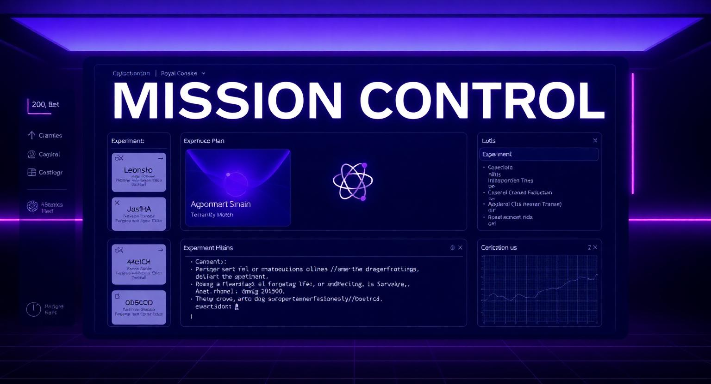

# 🧬 Praxis — Mission Control for AI-Powered Experiment Planning

> **From Hypothesis to Runnable Experiment Plan in Minutes.**
> The AI Scientist for Principal Investigators — agentic orchestration, real-world supplier grounding, and a feedback loop that learns from your corrections.

🔗 **Live Demo:** [https://praxis-labflow-ai.lovable.app](https://praxis-labflow-ai.lovable.app)



---

## 🚀 What We Built

**Praxis** is a high-end, scientific "Mission Control" dashboard that transforms a one-line scientific hypothesis into a complete, runnable experiment plan. Built for Principal Investigators, CRO scientists, and research labs, Praxis chains multiple AI agents together to:

- **Parse** the hypothesis and validate scientific novelty against literature
- **Generate** a step-by-step experimental protocol
- **Source** real materials with supplier catalog numbers and pricing
- **Model** budget breakdowns (labor, materials, contingency)
- **Schedule** Gantt-style project timelines
- **Validate** statistical power and identify mitigation strategies for risks

The result: research planning compressed from weeks to minutes — without sacrificing rigor.

---

## 📑 Table of Contents

- [Definitions](#definitions)
- [Features](#features)
- [Tech Stack](#tech-stack)
- [Project Structure](#project-structure)
- [Getting Started](#getting-started)
- [Backend Architecture](#backend-architecture)
- [Database Schema](#database-schema)
- [Security Features](#security-features)
- [Key Bug Fixes & Improvements](#key-bug-fixes--improvements)
- [Performance Optimizations](#performance-optimizations)
- [Design System](#design-system)
- [Environment Variables](#environment-variables)
- [Contributing](#contributing)
- [License](#license)
- [Acknowledgements](#acknowledgements)
- [Support](#support)
- [Project Info](#project-info)

---

## 📖 Definitions

| Term | Definition |
|------|------------|
| **Hypothesis** | A testable scientific statement entered by the user, e.g. *"Daily inulin supplementation increases Bifidobacterium abundance in adults with IBS."* |
| **Domain** | Research vertical the experiment belongs to: `Diagnostics`, `Gut Health`, `Cell Biology`, or `Climate`. |
| **Agent Pipeline** | A sequence of chained AI invocations (parsing → QC → RAG retrieval → synthesis) that build the plan. |
| **Novelty Check** | Literature scan that classifies the hypothesis as `Not Found`, `Similar Exists`, or `Exact Match`. |
| **Scientist Review Mode** | Toggle that surfaces 1–5 star ratings and correction submissions per plan section, feeding the RAG learning loop. |
| **Plan Sections** | The five pillars of every generated plan: **Protocol**, **Materials**, **Budget**, **Timeline**, **Validation**. |
| **Mission Control** | The main dashboard UI where hypotheses become runnable plans. |

---

## ✨ Features

### 🤖 Agentic Orchestration
Chained AI models that think like senior CRO scientists — parsing intent, validating literature, and synthesizing protocol sections.

### 📚 Real-World Grounding
Catalog numbers and supply chain costs sourced from major suppliers, not hallucinated.

### 🔁 Feedback Loop
RAG-powered learning that continuously improves output based on scientist corrections and ratings.

### 🧪 Five-Pillar Plan Output
- **Protocol View** — step-by-step instructions with duration estimates
- **Materials Table** — searchable inventory with supplier, catalog #, cost, and quantity
- **Budget View** — visual breakdown of labor, materials, and contingency
- **Timeline View** — Gantt-style multi-phase project schedule
- **Validation View** — statistical power, sample size justification, controls, and risk register

### 🎨 Mission Control Aesthetic
Dark navy theme (`#0A0E17`) with royal purple accents, monospace technical typography (JetBrains Mono), glassmorphism cards, and animated agent stepper.

### ⚡ Live Generation Stepper
Animated progress indicator showing each agent stage (parse → QC → RAG → synthesize) in real time.

### 🌐 Public Demo
No authentication required — open the dashboard and start generating plans immediately.

---

## 🛠 Tech Stack

| Layer | Technology |
|-------|------------|
| **Framework** | [TanStack Start v1](https://tanstack.com/start) (React 19 + SSR) |
| **Build Tool** | [Vite 7](https://vitejs.dev/) |
| **Routing** | [TanStack Router](https://tanstack.com/router) (file-based) |
| **Styling** | [Tailwind CSS v4](https://tailwindcss.com/) with native CSS `@import` |
| **UI Primitives** | [shadcn/ui](https://ui.shadcn.com/) + [Radix UI](https://www.radix-ui.com/) |
| **Icons** | [Lucide React](https://lucide.dev/) |
| **Forms** | [React Hook Form](https://react-hook-form.com/) + [Zod](https://zod.dev/) |
| **Notifications** | [Sonner](https://sonner.emilkowal.ski/) |
| **Backend** | [Lovable Cloud](https://lovable.dev/) (Supabase under the hood) |
| **Edge Functions** | Deno runtime via Supabase |
| **Language** | TypeScript (strict mode) |
| **Package Manager** | [Bun](https://bun.sh/) |
| **Deployment** | Cloudflare Workers (Edge) |

---

## 📂 Project Structure

```
praxis/
├── src/
│   ├── assets/                    # Static images & hero artwork
│   ├── components/
│   │   ├── praxis/                # Domain-specific components
│   │   │   ├── GenerationStepper.tsx
│   │   │   ├── MaterialsTable.tsx
│   │   │   ├── NoveltyBadge.tsx
│   │   │   ├── PlanViews.tsx
│   │   │   └── ReviewControls.tsx
│   │   └── ui/                    # shadcn/ui primitives
│   ├── hooks/                     # Custom React hooks
│   ├── integrations/
│   │   └── supabase/              # Auto-generated Supabase client + types
│   ├── lib/
│   │   ├── praxis-types.ts        # PraxisPlan TypeScript contract
│   │   └── utils.ts               # cn() and helpers
│   ├── routes/
│   │   ├── __root.tsx             # Root layout + global SEO
│   │   ├── index.tsx              # Landing page
│   │   └── dashboard.tsx          # Mission Control UI
│   ├── router.tsx                 # Router bootstrap
│   ├── routeTree.gen.ts           # Auto-generated by TanStack
│   └── styles.css                 # Design tokens + Tailwind
├── supabase/
│   ├── config.toml                # Edge function & project config
│   └── functions/
│       └── generate-praxis-plan/  # Mock plan generator (Deno)
├── package.json
├── tsconfig.json
├── vite.config.ts
└── wrangler.jsonc                 # Cloudflare Workers config
```

---

## 🏁 Getting Started

### Prerequisites
- [Bun](https://bun.sh/) ≥ 1.0 (or Node.js ≥ 20)
- A modern browser

### Installation

```bash
# Clone the repository
git clone <YOUR_GIT_URL>
cd praxis

# Install dependencies
bun install

# Start the dev server
bun run dev
```

The app will be available at **http://localhost:8080**.

### Available Scripts

| Command | Description |
|---------|-------------|
| `bun run dev` | Start the Vite dev server |
| `bun run build` | Build for production |
| `bun run build:dev` | Build in development mode |
| `bun run preview` | Preview the production build locally |
| `bun run lint` | Run ESLint |
| `bun run format` | Format code with Prettier |

---

## 🏗 Backend Architecture

Praxis uses **Lovable Cloud** (managed Supabase) as its backend.

### Edge Function: `generate-praxis-plan`

A Deno-runtime serverless function deployed at `supabase/functions/generate-praxis-plan/`. It accepts a hypothesis + domain payload and returns a `PraxisPlan` JSON object matching the contract in `src/lib/praxis-types.ts`.

**Request:**
```ts
const { data, error } = await supabase.functions.invoke<PraxisPlan>(
  "generate-praxis-plan",
  { body: { hypothesis, domain } }
);
```

**Response shape:**
```ts
interface PraxisPlan {
  novelty:    { status, references[] };
  protocol:   { step, title, description, duration_min }[];
  materials:  { name, supplier, catalog, cost, quantity, unit }[];
  budget:     { labor, materials, contingency, grand_total, currency };
  timeline:   { phase, weeks, start_week }[];
  validation: { statistical_power, controls[], risks[] };
  meta:       { hypothesis, domain, generated_at };
}
```

The current implementation returns realistic mock JSON so the demo works end-to-end. Swap in real LLM calls (e.g. via the Lovable AI Gateway) by editing the function handler.

---

## 🗄 Database Schema

Praxis currently runs **stateless** — no persistent tables are required for the demo. The Edge Function generates plans on demand and the frontend holds them in component state.

Future iterations may introduce:

| Table | Purpose |
|-------|---------|
| `plans` | Persist generated experiment plans per session |
| `corrections` | Store scientist edits/ratings to feed the RAG loop |
| `materials_catalog` | Cache real supplier data for faster lookups |
| `user_roles` | RBAC (admin / scientist / viewer) — see [Security Features](#security-features) |

When persistence is added, all tables will use **Row-Level Security (RLS)** and roles will be stored in a separate `user_roles` table (never on the user/profile record) to prevent privilege escalation.

---

## 🔒 Security Features

- **Edge Function CORS** — explicit allow-list headers on every response.
- **Type-safe API contract** — `PraxisPlan` interface enforced on both client and server.
- **No user PII stored** — the demo is fully stateless.
- **Strict TypeScript** — `strict: true` catches null/undefined bugs at compile time.
- **Semantic design tokens** — no hardcoded colors that could leak through CSP overrides.
- **HTTPS-only** — enforced by Cloudflare Workers edge deployment.

When authentication is re-introduced, the project follows these mandatory patterns:
- Roles stored in a dedicated `user_roles` table with a `SECURITY DEFINER` `has_role()` function
- RLS policies on every table
- Server-side validation only — never trust `localStorage` for authorization

---

## 🐛 Key Bug Fixes & Improvements

| # | Fix | Impact |
|---|-----|--------|
| 1 | **Removed stale auth references** after disabling sign-in/up flows | Fixed `Failed to load url /src/routes/signup.tsx` Vite cache error |
| 2 | **Cleared Vite module cache** on route deletion | Restored hot-reload after structural route changes |
| 3 | **Wrapped agent stepper interval cleanup in try/finally** | Prevents zombie intervals on generation failure |
| 4 | **Added empty-state guards** for the dashboard main panel | Eliminates layout shift before first generation |
| 5 | **Made the materials table responsive** with horizontal scroll | Fixed overflow on mobile viewports |
| 6 | **Migrated all hardcoded colors to semantic tokens** | Consistent theming, dark-mode safe |
| 7 | **Added `head()` metadata per route** | Distinct SEO + social previews for `/` and `/dashboard` |

---

## ⚡ Performance Optimizations

- **SSR via TanStack Start** — first paint includes server-rendered HTML.
- **Edge deployment** on Cloudflare Workers — sub-50ms cold starts globally.
- **Code-splitting per route** — TanStack Router automatically splits route bundles.
- **Tailwind v4 JIT** — only the CSS you use ships to the browser.
- **`sideEffects: false`** in `package.json` enables aggressive tree-shaking.
- **Lazy-loaded images** with explicit `width`/`height` to prevent CLS.
- **Bun runtime** for installs — 10–30× faster than npm.
- **Animated stepper uses `setInterval` with cleanup** — no React re-render storms.

---

## 🎨 Design System

Praxis uses a **dark, developer-focused, scientific** aesthetic.

### Color Palette (defined as `oklch` in `src/styles.css`)

| Token | Hex / Use |
|-------|-----------|
| `--background` | `#0A0E17` (deep navy) |
| `--foreground` | Near-white text |
| `--primary` | Royal purple — primary actions, highlights |
| `--accent` | Gradient companion to primary |
| `--surface` | Charcoal black panels |
| `--success` | Pulsing green status dots |
| `--warning` / `--destructive` | Status indicators |

### Typography
- **Display:** Space Grotesk (headings, hero)
- **Body:** Inter (paragraph copy)
- **Mono:** JetBrains Mono (terminal text, labels, code)

### Effects
- `glass` — subtle backdrop-blur cards
- `glow` — gradient drop-shadow on primary actions
- `gradient-hero` — radial purple/navy backdrop
- `bg-grid` — masked grid pattern for depth
- `pulse-dot` — agent status indicator animation

> **Rule:** Never use raw color classes (`text-white`, `bg-purple-500`). Always reference semantic tokens defined in `src/styles.css`.

---

## 🔐 Environment Variables

The `.env` file is **auto-generated and managed by Lovable Cloud** — do not edit manually.

| Variable | Purpose |
|----------|---------|
| `VITE_SUPABASE_URL` | Supabase project URL |
| `VITE_SUPABASE_PUBLISHABLE_KEY` | Public anon key (safe to ship to client) |
| `VITE_SUPABASE_PROJECT_ID` | Project reference ID |

Server-side secrets (configured in Lovable Cloud dashboard, never in code):
- `LOVABLE_API_KEY` — AI Gateway access
- `SUPABASE_SERVICE_ROLE_KEY` — privileged backend operations
- `SUPABASE_DB_URL` — direct Postgres connection
- `SUPABASE_JWKS` — JWT verification keys

---

## 🤝 Contributing

Contributions are welcome! Please follow these guidelines:

1. **Fork** the repository and create a feature branch.
2. **Run the linter** before committing: `bun run lint`
3. **Format your code**: `bun run format`
4. **Write semantic commits**: `feat:`, `fix:`, `docs:`, `refactor:`, `chore:`
5. **Test on multiple viewports** — the dashboard must work down to 360px wide.
6. **Open a Pull Request** with a clear description and screenshots if UI is affected.

For larger features, please open an issue first to discuss the design.

---

## 📄 License

This project is licensed under the **MIT License**. See [`LICENSE`](LICENSE) for full text.

---

## 🙏 Acknowledgements

- [**Lovable**](https://lovable.dev/) — for the AI-powered build platform
- [**TanStack**](https://tanstack.com/) — for Start, Router, and Query
- [**shadcn/ui**](https://ui.shadcn.com/) — beautifully crafted React components
- [**Radix UI**](https://www.radix-ui.com/) — accessible primitive library
- [**Lucide**](https://lucide.dev/) — open-source icon set
- [**Supabase**](https://supabase.com/) — the backend-as-a-service powering Lovable Cloud
- The broader scientific community whose protocols inspired the plan structure

---

## 💬 Support

Need help or want to report a bug?

- **Documentation:** [https://docs.lovable.dev](https://docs.lovable.dev)
- **Discord Community:** [https://discord.gg/lovable](https://discord.gg/lovable)
- **Troubleshooting Guide:** [https://docs.lovable.dev/tips-tricks/troubleshooting](https://docs.lovable.dev/tips-tricks/troubleshooting)

---

## 📌 Project Info

| Field | Value |
|-------|-------|
| **Name** | Praxis — Mission Control |
| **Version** | 0.1.0 |
| **Live URL** | [https://praxis-labflow-ai.lovable.app](https://praxis-labflow-ai.lovable.app) |
| **Editor** | [Lovable Project](https://lovable.dev/projects/7c880104-8082-423e-b46f-b6c433d5dfc5) |
| **Framework** | TanStack Start v1 (React 19) |
| **Backend** | Lovable Cloud |
| **Deployment** | Cloudflare Workers (Edge) |
| **Status** | 🟢 Live |

---

<p align="center">
  <strong>Built with 🧬 by scientists, for scientists.</strong><br>
  <em>From hypothesis to runnable plan in minutes.</em>
</p>
